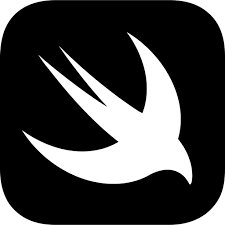

<!--Message to the programmer.:-->


<h1 align="center" style="color:pink; font-size:24px;"><strong>Promo.Claims or was it Claims.Promo</strong></h1>
<div align="center"><table style="color: white; background-color: pink;">
            <tr>
       <td align="center" style="width: 100px;"></td>
    <td align="center" style="width: 100px;"></td>
    <td align="center" style="width: 100px;"></td>
    <td align="center" style="width: 100px;"></td>
            <td align="center" colspan="2"  rowspan="2"> +   +  =  
             <a href="https://github.com/How-do-i-get-your-attention/promo.claims-or-was-it-claims.promo/tree/master#the-history-starts-from-the-1960s-with-arpanet-connecting-everyone-through-the-internet">
                        
                        </a>
             </td>
  </tr>
      <tr>
       <td align="center" style="width: 100px;"></td>
    <td align="center" style="width: 100px;">
                <a href="https://github.com/How-do-i-get-your-attention/promo.claims-or-was-it-claims.promo/tree/master#android-studio">
                  
                </a>
                  </td>
    <td align="center" style="width: 100px;">  </td>
    <td align="center" style="width: 100px;">  </td>
       
  </tr>
   <tr>
    <td align="center" style="width: 100px;">
               <a href="https://github.com/How-do-i-get-your-attention/promo.claims-or-was-it-claims.promo/tree/master#the-history-starts-from-the-1960s-with-arpanet-connecting-everyone-through-the-internet">
                        
                        </a>
               </td>
    <td align="center" style="width: 100px;">
                <a href="https://github.com/How-do-i-get-your-attention/promo.claims-or-was-it-claims.promo#android">
                
                </a>
                            </td>
    <td align="center" style="width: 100px;">
    <td align="center" style="width: 100px;"></td>
    <td align="center" style="width: 100px;"></td>
    <td align="center" style="width: 100px;"></td>
  </tr>
   <tr>
    <td align="center"></td>
    <td align="center">
                
    </td>
    <td align="center"></td>
    <td align="center"></td>
      <td align="center">
                  <a href="https://github.com/How-do-i-get-your-attention/promo.claims-or-was-it-claims.promo/tree/master#android-studio">
                  
                  </a>
                  +   
                  + 
           <td>comming soon</td>
  </tr>
  <tr>
    <td align="center"></td>
    <td align="center"></td>
    <td align="center"></td>
    <td align="center"></td>
    <td align="center">
                             <a href="https://github.com/How-do-i-get-your-attention/promo.claims-or-was-it-claims.promo/tree/master#android-studio">
                  
                  </a>
                +  
                + 
        <td>comming soon</td>
  </tr>
  <tr>
    <td align="center"> </td>
     <td align="center"></td>
    <td></td>
     <td align="center"></td>
        <td align="center">             <a href="https://github.com/How-do-i-get-your-attention/promo.claims-or-was-it-claims.promo/tree/master#android-studio">
                  
                  </a>
                    +   
              </td> 
             <td>comming soon</td>
  </tr>
  <tr>
    <td align="center"></td>
     <td align="center"></td>
    <td align="center"></td>
     <td align="center"></td>
         <td align="center">
                                  <a href="https://github.com/How-do-i-get-your-attention/promo.claims-or-was-it-claims.promo/tree/master#android-studio">
                  
                  </a> +
                     
              </td>
             <td>comming soon</td>
  </tr>
  <tr>
    <td align="center"></td>
    <td align="center"></td>
    <td></td>
    <td align="center"></td>
    <td align="center">
                             <a href="https://github.com/How-do-i-get-your-attention/promo.claims-or-was-it-claims.promo/tree/master#android-studio">
                  
                  </a>
                +   </td>
             <td>comming soon</td>
  </tr>
   <tr>
    <td align="center"></td>
          <td></td>
    <td align="center"></td>
    <td></td>
    <td align="center"  colspan="2">
             +   +  +   
    </td> 
           
  </tr>
              <tr>
     <td></td>
        <td colspan="5"><sub>You</sub></td>
  </tr>
  <tr>
     <td></td>
        <td colspan="5"><sub>The installation needs to be done separately by  or  </sub></td>
  </tr>
            
   <tr>
     <td></td>
               <td colspan="5"><sub>The installation is done by the linker to a application.  </sub></td>
  </tr>
</table>
</div>   
<div align="center"> </div>
<!--
Programmers let's get together
A document have have many layers.
-->
<p align="center">Did you know about milliseconds? humans only see 24 or 25 frames per second, which is very close to the 25-millisecond per image.</p>


<div align="center">
    
    
   
  
              
                  
                      
</div>

C was not created by Steve Jobs. C was created by Dennis Ritchie and Ken Thompson at Bell Labs in the early 1970s.<br/> <br/>
Steve Jobs was a co-founder of Apple Inc. and played a significant role in the development of Apple's products, including the Apple II, Macintosh, and the iPhone. While Apple's products have been developed using a variety of programming languages, including C and C++, Steve Jobs was not directly involved in the creation of those languages.<br/> <br/>
However, Steve Jobs did recognize the importance of technology and software in the success of Apple, and he played a key role in driving the company's focus on user experience and design. He also had a strong influence on the development of the personal computer industry, and his vision helped to shape the way that we use technology today.<br/> <br/>
Objective-C was created by Brad Cox and Tom Love at their company Stepstone in the early 1980s. Cox and Love were developing software tools for building distributed systems, and they wanted a programming language that would allow for dynamic binding and message passing between objects.
<br/><br/>
Objective-C was based on the existing C programming language, with added features for object-oriented programming. It quickly gained popularity in the NeXTSTEP development community, and was used extensively in the development of the NeXTSTEP operating system and the applications that ran on it.<br/> <br/>
In 1996, Apple acquired NeXT Computer, and with it, the rights to Objective-C.<br/><br/>
Steve Jobs co-founded the company NeXT Computer Inc. after leaving Apple in 1985, and NeXT was the company that developed the NeXTSTEP operating system, which was based on the Mach kernel and used Objective-C as its primary programming language.<br/><br/>
Steve Jobs was one of the co-founders of Apple Inc. in 1976 and played a major role in the development of the company and its products, including the Apple II, Macintosh, and later products such as the iPod, iPhone, and iPad.<br/><br/>
  One of the most famous collaborations between Gates and Jobs was the development of software for the original Macintosh computer in the early 1980s. Microsoft developed several applications for the Macintosh, including Microsoft Word and Microsoft Excel, which became some of the most popular software programs for the platform.
  <br/><br/>
  Steve Jobs was the CEO of NeXT Computer Inc. from its founding in 1985 until its acquisition by Apple Inc. in 1996. So, he was the owner of NeXT for a little over 10 years.
  <br/><br/>
After the acquisition of NeXT by Apple, Steve Jobs returned to Apple as an advisor, and eventually became the CEO of Apple in 1997. He played a key role in turning around Apple's fortunes and making it one of the most successful technology companies in the world.
  <br/><br/>
  In the early days of Microsoft, the company primarily developed software for the Altair 8800, one of the first commercially successful personal computers. The programming language used for this software was primarily assembly language, which was a low-level language that allowed for direct control over the computer's hardware. <br/>  <br/>
  The Altair 8800 was designed and produced by the company MITS (Micro Instrumentation and Telemetry Systems), which was founded by Ed Roberts and Forrest Mims in 1969. MITS was based in Albuquerque, New Mexico, and initially focused on developing electronic calculators and other scientific instruments. <br/>  <br/>
They are so old that I couldn't find a png for them so I have saved their logo as mark.jpg 🕵️
Mr Bill gates "Micro" -Soft come on dude.!<br/>  <br/>
As Microsoft grew and began developing software for other platforms, such as the IBM PC, the company began using higher-level programming languages such as C, which allowed for faster development and easier maintenance of software. C++ was later introduced as an extension of the C programming language, and Microsoft began using it for developing more complex software products.<br/><br/>
  C++ is not owned or controlled by Microsoft, but Microsoft is one of the major contributors to the development and standardization of the language. Microsoft has been actively involved in the development of C++ for many years, and has developed many tools and libraries for working with C++.<br/><br/>

Microsoft uses C++ extensively in the development of its software products, including the Windows operating system, Microsoft Office, Visual Studio development environment, and many others. C++ is a powerful programming language that provides high performance and allows for efficient low-level memory management, making it well-suited for developing complex software applications.<br/><br/>

In addition to using C++ in its own software products, Microsoft has contributed to the development of C++ through its participation in the ISO C++ standardization process, and through the development of the Visual C++ compiler and related tools. Overall, while C++ is not owned by Microsoft, the company has played a significant role in the development and advancement of the language.<br/><br/>

Thanks to Android for a wide range of brands, including Alcatel, Acer, Amazon, Archos, ASUS, BlackBerry, Celkon, Coolpad, Elephone, Fujitsu, Google, HP, HTC, Huawei, iBall, Infinix, Intex, Karbonn, Lava, Lenovo, LG, Micromax, Meizu, Motorola, Oppo, Panasonic, Philips, Razer, Realme, Samsung, Sharp, Sony, Swipe, TCL, Tecno, Toshiba, Vivo, Wiko, Xiaomi, Yota Devices, ZTE, and many more.

The similarities between Android Q gestures and iOS gestures are undeniable. The concept of swiping up from the bottom of the screen to go home or access recent apps is a distinctive feature of Apple's iOS interface.

Copying ideas in the tech industry is not uncommon, and it has happened in both directions between Apple and Google. Steve Jobs himself acknowledged that great ideas are often borrowed or "stolen" to create something new and better.

While the basic idea of a bottom bar gesture is shared, Android's implementation is not identical to iOS. Android has its own distinct commands and features, such as contextual app suggestions and a universal search bar. Additionally, Android's edge-of-screen back gestures are specific to the Android platform.

On the other hand, Apple has also borrowed concepts from Android. For example, having a card-based info feed one swipe to the right from the home screen (Today View) was inspired by Google's Google Now/Google Feed. Apple also adopted the swipe-down gesture to access and manage notifications, a feature that originated in Android.

The back-and-forth borrowing of ideas is a common occurrence in tech evolution. Good ideas tend to spread across platforms, leading to the development of standards and benefiting users of various devices.

It's worth noting that sometimes, directly copying concepts may not work well in a different environment. For example, emulating Apple's App Shortcuts on Android may not be the most sensible approach. Similarly, Android's attempt to replicate iOS-like gestures for opening the Overview interface may feel awkward and inconsistent.

Ultimately, feeling indignant about companies copying each other's ideas misses the point. Apple and Google are corporations, and consumers are the ones who benefit from their continuous efforts to improve products.

In the end, this evolution and idea borrowing lead to progress and better products for all users. Regardless of platform preference, consumers ultimately win by getting improved gadgets, even if it involves some degree of copying along the way.

<!--Message to the programmer.:-->
<h2 align="center"><strong>Unveiling the Power Within: Decoding the Essence of Auditory Perception</strong></h2>
<!--Programmers let's get together-->
<!--
A document have have many layers.
-->
<p align="center">
The human auditory system is capable of detecting sound waves in the range of 20 Hz to 20,000 Hz. The perception of sound is a continuous process and not divided into distinct frames like in video or images. Therefore, the concept of "frames per millisecond" is not applicable to sound perception.
<br/><br/>
However, the human auditory system is capable of distinguishing between sounds that differ by as little as 2-3 Hz in frequency, and can detect changes in loudness as small as 1 dB. This high level of sensitivity enables humans to perceive complex sounds such as music, speech, and environmental sounds with a high degree of accuracy and fidelity.
</p>
<!--
Why did i choice c++.?
It runs on any device. Server Mobile Tabelt watch anything..
But if you see! about "C". I still tell the story.(PUBLIC)
About apple, microsoft and android. but for real. android also have alot c++ and that's also in apple to.
but the truth is just that there are different ways of adding files to it. And compile it.
And more trust way to do it.
I personally use Visual Studio "Code" Remember "Code".
There more than you know.
have you read the source code in the other files.
I can also figure out how to make comments in c
If you wish to join find away


-->
<div align="center">
    
    
   
  
</div>

<!--
Dear team,

I wanted to clarify some ground rules for being part of this project. As the inventor and CEO of how-to-get-your-attention.com, I want to make sure that everyone involved understands their roles and responsibilities.
First, I want to make it clear that we do not use open source or other free code.(Without the approval of pirasath luxchumykanthan) We pay annually for licenses from Microsoft, Apple, Android, other and hosting services.
No more mistake for c# or python or what ever
WEE BUILD!!!!

Thank you for your time and commitment to this project.
-->
<h2 align="center"><strong>The Cryptic Project: Revealing Select Source Code for Public Glimpses</strong></h2>
Attention developers and tech enthusiasts! Welcome to this groundbreaking project that unveils a sneak peek into our carefully crafted source code. While not open source, it carries the spirit of true programmers at its core. We invite you, passionate developers, to dive into the accompanying README.MD file, explore the code, and leave your markdown (MD) comments to join us on this exhilarating journey.
   <br/><br/> 
When it comes to our choice of platforms, we stand proudly on the shoulders of giants. For our Apple products, we harness the mighty Swift, a language designed to empower developers like you. Swift's modernity and elegance make it the perfect companion for iOS, macOS, watchOS, and tvOS app development. With Swift, we tap into Apple's native frameworks and unleash a new level of seamless integration and top-notch performance. Get ready to create stunning experiences that dazzle Apple users!
   <br/><br/> 
But our ambition doesn't stop there. For our Android adventures, we turn to the trusty Java. Battle-tested and revered, Java is the driving force behind countless Android success stories. It opens doors to a vibrant community, a galaxy of libraries and frameworks, and the boundless possibilities of the Android universe. Strap in and prepare to build remarkable apps that captivate the Android crowd!
   <br/><br/> 
And let's not forget our partnership with Microsoft. We embrace the raw power of C++, a language that fuels our front-end on Microsoft platforms. With C++, we unleash untamed performance, control over system resources, and seamless integration with Microsoft's technologies. We venture into the realm of Windows, armed with a language that unlocks the full potential of Microsoft's ecosystem. Prepare to conquer Windows with your coding prowess!
   <br/><br/> 
Now, let's talk servers. We choose Windows Server, fortified with Microsoft's unwavering commitment to rock-solid security. Rest assured, we take your data's safety seriously. Microsoft invests substantial resources to ensure their systems are always on the cutting edge of security. While others falter, we confidently stride forward, leaving behind any concerns about vulnerabilities. Windows Server becomes our fortress, providing stability, top-notch performance, and the comprehensive tools we need to fortify our infrastructure.
   <br/><br/> 
We live in a fast-paced world where things change in the blink of an eye. That's why we pledge to keep this document fresh and relevant. As regulations evolve and standards shift, we'll be here, updating it to ensure we're always in sync with the industry's pulse. If you have any questions or suggestions, don't hesitate to reach out. Together, we'll shape the future of technology!
   <br/><br/> 
Unleash your creativity, leave your mark in the source code, and join us on this epic quest to revolutionize the tech landscape. Let's push boundaries, defy limits, and create software that leaves a lasting impression. Together, we'll build a world where innovation knows no bounds!any questions, feel free to reach out.
    <br/><br/>  
http://www.how-to-get-your-attention.com
<!--For you: pirasath.luxchumykanthan@how-to-get-your-attention.com for public office@how-to-get-your-attention.com -->
<!--
"I will send you an email" if you are accepted as a presenter with your first name and dot and your lastname@how-to-get-your-attention.com
I also know how to make comment in code..
-->
<strong><u>
<!-- 
HyperText Markup Language, was developed by Tim Berners-Lee in the early 1990s while he was working at CERN Then everyone was connected 
Thats why i try to make this work in HTML to
-->
</u></strong>
<h3 align="center">The history starts from the 1960s with ARPANET. Connecting everyone through the internet.</h3>

<h2>"Your memory also gets old."</h2>
  by:<br/>  
Pirasath Luxchumykanthan, Inventor and Founder<br/>

<h1>IPA and APK: A Common File Format</h1>
The IPA (iOS App Store Package) and APK (Android Application Package) file formats, although designed for different mobile platforms, share a common underlying structure. Both IPA and APK files utilize the ZIP file format for compression, organization, and distribution of their respective application contents.
The ZIP file format, originally introduced by Phil Katz in the late 1980s, provides a standardized approach for compressing files and directories into a single archive. Over time, it has undergone updates and extensions to support new features, improved compression methods, and enhanced compatibility.
The file signatures of IPA and APK files reveal their adherence to the ZIP format. Both IPA and APK files begin with the byte sequence 50 4B 03 04 (or 0x50, 0x4B, 0x03, 0x04 in hexadecimal representation), which corresponds to the ASCII characters "PK\x03\x04". This file signature indicates that the files follow the ZIP file format specifications.

Within the ZIP archive of an IPA or APK file, you can find various components of the respective applications. This includes the executable binary, resources, assets, configuration files, and other elements required for the application's functionality.

While the primary purpose of the ZIP format is to compress and package the application contents, additional elements specific to each platform are present. For example, APK files include resources and code specific to Android, whereas IPA files contain resources and code for iOS.

The zlib library, an open-source library developed by Jean-loup Gailly and Mark Adler, underlies the compression and decompression functionality of the ZIP format used in both Android and iOS. This library has been widely adopted and integrated into various software systems, including the Android platform.

In conclusion, the IPA and APK file formats leverage the ZIP file format to compress, organize, and distribute their application contents. Despite their platform differences, both formats share a common foundation, facilitating efficient packaging and distribution of mobile applications for iOS and Android respectively.

<h1>Understanding File Formats: Executable Files and DMG Files</h1>
When working with different file formats, understanding their structures and characteristics can provide valuable insights. Let's explore the first bytes of two common file formats: executable files (".exe") and DMG (Disk Image) files.
<h2>Executable Files (".exe")</h2>
Executable files play a fundamental role in running applications on various operating systems. For Windows executables, the first two bytes hold significance. They are typically "MZ" (0x4D, 0x5A) in the ASCII representation. These two bytes are commonly referred to as the "Magic Number." They indicate that the file follows the Portable Executable (PE) file format used by Windows. The PE format includes headers, sections, and other data structures essential for proper execution.
It's important to note that other operating systems may have different file format standards for their executable files, and the first bytes may vary accordingly. The specific file format and structure determine how the operating system recognizes and interprets the executable file.

<h2>DMG (Disk Image) Files</h2>
DMG (Disk Image) files are often associated with macOS and serve as containers for file systems, applications, or entire disk volumes. The first byte in a DMG file can vary based on the specific DMG format used.
In the case of Apple Disk Images (DMG) commonly used on macOS, the first byte is typically "78" (0x78) in hexadecimal representation. This value indicates that the file is compressed using the zlib compression algorithm. However, it's important to note that DMG files can have different formats and variations, and the first byte may vary depending on the specific DMG format being used.

The contents of DMG files can include file systems, application files, metadata, and more. These files often require mounting or extracting to access their contents properly.

<h2>Conclusion</h2>
Understanding the first bytes of executable files and DMG files provides insights into their respective file formats and structures. While the first bytes help identify the file format, it's essential to consider the overall structure, headers, and other elements within the file to fully comprehend its functionality.
Exploring file formats broadens our knowledge of how different systems handle and interpret files. By understanding these nuances, we can better work with, analyze, and appreciate the rich diversity of file formats in the digital world.


Well, now that you've made it this far reading about things I've written, you might as well continue and dive into the thrilling adventures of my diary. Brace yourself for a rollercoaster of emotions, dramatic plot twists, and the occasional doodle of a questionable quality. Enjoy the journey!

<h1> C++ windows.h</h1>

## Overview
Windows.h is a header file in the Windows API (Application Programming Interface) that serves as a gateway to various functionality provided by the Windows operating system. It contains declarations and definitions for functions, constants, data types, and structures that are used for interacting with the Windows platform.

## Purpose
The Windows.h header file allows developers to access a wide range of features and services offered by the Windows operating system. It provides access to functions for creating and managing windows, handling input and events, interacting with files and directories, accessing system information, and much more. By including Windows.h in your C++ code, you can harness the power of the Windows API and develop applications that leverage the capabilities of the Windows platform.

## Usage
We use this to connect to Windows Server systems. 
We like to use Windows Server to protect our clients, as it includes virus protection. Additionally, it allows us to expand our server farm easily and efficiently.

```
#include <Windows.h>
```

<h1> C++ wmain</h1>

# Understanding `wmain` in C++

`wmain` is a special function used in C++ programs on Windows platforms. It's similar to the traditional `main` function, which is the typical entry point for a C++ program, but is designed to handle wide strings (Unicode).

## Parameters

- `argc`: An integer representing the count of command-line arguments.
- `argv`: An array of wide string command-line arguments.
- `envp`: An array of environment variables.

Here, `argc` represents the number of command-line arguments passed to the program, `argv` is an array of wide character strings containing the command-line arguments, and `envp` is an array of wide character strings containing the program's environment variables.

## Usage of `wmain`

The `wmain` function can be used similarly to the `main` function. It allows you to access and process command-line arguments and perform operations accordingly. Here's an example illustrating the basic usage of `wmain`:

```
#include <Windows.h>
int wmain(int argc, wchar_t* argv[], wchar_t* envp[]) 
{
    return 0;
}
```

## Understanding `return 0`

In C++ programs, the `main` function or equivalent (like `wmain`) is expected to return an integer as an exit status. 

## Understanding `return 1`

In C++ programs, `return 1;` within the `main` function or equivalent (like `wmain`) signifies that the program has encountered an error and is terminating.


# Configuration Types in Visual Studio

In Visual Studio, the **Configuration Type** setting in a project's property pages determines the type of output file your project creates. Here are the three key types:

## 1. `.exe` (Application)
This creates an executable file. An `.exe` file contains a program that can run directly when clicked. This is the default setting for most project types.

## 2. `.dll` (Dynamic-Link Library)
This creates a Dynamic-Link Library, which is a binary file containing code and data that multiple programs can use simultaneously. DLLs promote code reuse and efficient memory usage by allowing multiple applications to access the contents of a single file.

## 3. `.lib` (Static Library)
This creates a static library. Static libraries are essentially collections of object files that are linked into an application during the linking phase of compilation, and they exist as a single, standalone file.

# How to find Configuration Type in Visual Studio

1. Open your project in Visual Studio.
2. In **Solution Explorer**, right-click on your project, then click **Properties**.
3. In the **Properties** window, expand the **Configuration Properties** list.
4. Click on **General**.
5. The first setting is **Configuration Type** where you can choose between `.exe`, `.dll`, and `.lib`.


<h1>Starting a new C++ project</h1>
Starting a new C++ project in Visual Studio can be as simple as creating an empty project, naming it "Server", and adding a main.cpp file. However, understanding the data that Windows provides us is crucial for more advanced programming tasks.

Let's illustrate this by writing a code snippet:

```
#include <Windows.h>
#include <iostream>
using namespace std;
int wmain(int argc, wchar_t* argv[], wchar_t* envp[]) {
    // Print the number of command-line arguments
    wcout << L"Number of command-line arguments: " << argc << endl;
    wcout << L"argv: "  << endl;
    // Loop through each command-line argument and print
    for (int i = 0; i < argc; i++)
        wcout << argv[i] << endl;
    wcout << L"envp: " << endl;
    // Loop through each environment variable and print
    for (wchar_t** env = envp; *env != 0; env++)
        wcout << *env << endl;
    return 0;
}
```

In the above code, we print out some essential data. For instance, we display the number of command-line arguments, the arguments themselves, and the environment variables.

When executed, it should look something like this:
```
Number of command-line arguments: 1
argv:
D:\How-do-i-get-your-attention\promo.claims-or-was-it-claims.promo\Server\x64\Release\Server.exe
envp:
ALLUSERSPROFILE=C:\ProgramData
APPDATA=C:\Users\{username}\AppData\Roaming
CommonProgramFiles=C:\Program Files\Common Files
...
USERPROFILE=C:\Users\{username}
VisualStudioDir=C:\Users\{username}\OneDrive\Dokumenter\Visual Studio 2022
...
```

This example demonstrates the essential data that Windows provides, which includes command-line arguments and environment variables. By understanding and utilizing this data, you can create more complex and robust programs in C++.

Why do we need this information? It's actually quite valuable when developing software. It allows us to understand our application's runtime environment, which is crucial when performing tasks such as software installations or debugging. Accessing command-line arguments can inform our program about user-specified parameters, while environment variables can provide context about the system our software is running on. This understanding can help us tailor our software to function optimally under various conditions and configurations.


"How do we access similar data on other platforms such as iOS, macOS, or Android? in c++ Do we need all the information that these platforms can provide? These are important considerations, and we'll delve deeper into these topics later."

Please note that the specific methods for accessing environment variables and command-line arguments can vary between different operating systems. On Unix-based systems like macOS and iOS, you can generally access this data in a similar way to Windows. However, for Android, due to its unique architecture and security model, accessing such information might require different approaches or might not be readily available at all. We'll explore these differences in detail in upcoming discussions.

"As I continue to write code, I will provide updates so you can follow along with the progress."

I've interpreted your sentence as indicating that i be sharing updates about the code i writing. 
By Pirasath Luxchumykanthan 
(BTW. READ(no space)ME.(md) AS SOUCE CODE)
<!--
Okay, that's cool!"

If you have any more text you'd like me to review or any further questions, feel free to ask.
hello@how-do-i-get-your-attention.com
-->
<!--All under here is what i do Pirasath Luxchumykanthan.:-->


```cpp
// main.cpp

#include "PCOrCP.h"

#pragma warning(disable: 26444)

int PCOrCP::Argc = 0;
wchar_t** PCOrCP::Argv = nullptr;
wchar_t** PCOrCP::Envp = nullptr;

PCOrCP::PCOrCP(int argc, wchar_t* argv[], wchar_t* envp[]) {
    PCOrCP::Argc = argc;
    PCOrCP::Argv = argv;
    PCOrCP::Envp = envp;
    PCOrCP::Init();
}

int wmain(int argc, wchar_t* argv[], wchar_t* envp[]) {
    PCOrCP(argc, argv, envp);
    return 0;
}
```

In the code above, I made some formatting adjustments and removed unnecessary comments. The `PCOrCP` constructor receives the `argc`, `argv[]`, and `envp[]` parameters and initializes the corresponding static members.

```cpp
// PCOrCP.h

#pragma once

#include <iostream>

class PCOrCP {
public:
    static int Argc;
    static wchar_t** Argv;
    static wchar_t** Envp;

    static void Init() {
        std::cout << "Init works perfectly" << std::endl;
    }

    PCOrCP(int argc, wchar_t* argv[], wchar_t* envp[]);
    ~PCOrCP() {
    }
};
```

In the `PCOrCP.h` file, I included the necessary `iostream` library for the `std::cout` statement. I also corrected the message inside the `Init()` function to say "Init works perfectly."

It's important to note that the provided code doesn't have any functional implementation beyond printing the message in the `Init()` function.


```cpp
// PCOrCP.h

#pragma once

#include <iostream>

class PCOrCP {
public:
    static wchar_t** Argv;
    static wchar_t** Envp;

    static void Init() {
        std::cout << "Init works perfectly" << std::endl;
    }

    PCOrCP(wchar_t* argv[], wchar_t* envp[]);
    ~PCOrCP() {
    }
};
```

In the `PCOrCP.h` file, I removed the `static int Argc` member since it is no longer being used.

```cpp
// main.cpp

#include "PCOrCP.h"

#pragma warning(disable: 26444)

wchar_t** PCOrCP::Argv = nullptr;
wchar_t** PCOrCP::Envp = nullptr;

PCOrCP::PCOrCP(wchar_t* argv[], wchar_t* envp[]) {
    PCOrCP::Argv = argv;
    PCOrCP::Envp = envp;
    PCOrCP::Init();
}

int wmain(int argc, wchar_t* argv[], wchar_t* envp[]) {
    PCOrCP(argv, envp);
    return 0;
}
```

In the `main.cpp` file, I removed the `int argc` parameter and updated the constructor accordingly.

With these changes, the `int argc` parameter is no longer needed, and you can directly pass `argv` and `envp` to the `PCOrCP` constructor. The program will execute the `Init()` function and print the "Init works perfectly" message.


```cpp
#pragma once
#include <iostream>

class PCOrCP
{
private:
public:
	static wchar_t** Argv;
	static wchar_t** Envp;
	static void Init();
};
```

In the updated text, I made the necessary formatting improvements and adjusted the placement of the comment. Additionally, I added a comment inside the `Services()` function to indicate that it is the place where your services implementation should be placed.

The function `Services()` is declared as private, which means it can only be accessed within the `PCOrCP` class and is not accessible from other files or classes. This encapsulation ensures that the implementation details of the services are hidden from external code, promoting better code organization and security.

Please let me know if there is anything else I can help you with!
