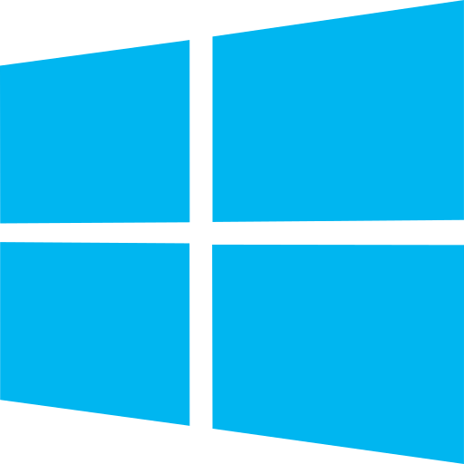

<!--Message to the programmer.:-->

<h1 align="center" style="color:pink; font-size:24px;"><strong>Promo.Claims or was it Claims.Promo</strong></h1>

<table style="color: white; background-color: pink;">
            <tr>
       <td align="center" style="width: 100px;"></td>
    <td align="center" style="width: 100px;"></td>
    <td align="center" style="width: 100px;">
    <td align="center" style="width: 100px;"></td>
            <td align="center" colspan="2"  rowspan="2"> +   +  =  
             
             </td>
  </tr>
      <tr>
       <td align="center" style="width: 100px;"></td>
    <td align="center" style="width: 100px;"></td>
    <td align="center" style="width: 100px;">
    <td align="center" style="width: 100px;"></td>
       
  </tr>
   <tr>
    <td align="center" style="width: 100px;">
               
               </td>
    <td align="center" style="width: 100px;">
                
                            </td>
    <td align="center" style="width: 100px;">
    <td align="center" style="width: 100px;"></td>
    <td align="center" style="width: 100px;"></td>
    <td align="center" style="width: 100px;"></td>
  </tr>
   <tr>
    <td align="center"></td>
    <td align="center"></td>
    <td align="center"></td>
    <td align="center"></td>
      <td align="center"> +  +  +   +  </td> 
           <td>comming soon</td>
  </tr>
  <tr>
    <td align="center"></td>
    <td align="center"></td>
    <td align="center"></td>
    <td align="center"></td>
    <td align="center"> +  +  +   + 
        <td>comming soon</td>
  </tr>
  <tr>
    <td align="center"> </td>
     <td align="center"></td>
    <td></td>
     <td align="center"></td>
        <td align="center"> +  +  +   +  </td> 
             <td>comming soon</td>
  </tr>
  <tr>
    <td align="center"></td>
     <td align="center"></td>
    <td align="center"></td>
     <td align="center"></td>
         <td align="center"> +  +  +   +   </td>
             <td>comming soon</td>
  </tr>
  <tr>
    <td align="center"></td>
    <td align="center"></td>
    <td></td>
    <td align="center"></td>
    <td align="center"> +  +  +   +  </td>
             <td>comming soon</td>
  </tr>
   <tr>
    <td align="center"></td>
          <td></td>
    <td align="center"></td>
    <td></td>
    <td align="center"  colspan="2">
       <!-- I made this bce is us developer-->
     +   +  +    +  
     </td> 
           
  </tr>
  <tr>
     <td></td>
        <td colspan="5">The installation needs to be done separately by   </td>
  </tr>
   <tr>
     <td></td>
               <td colspan="5">The installation is done by the linker to a application.  </td>
  </tr>
</table>

   
  

<!--
Programmers let's get together
A document have have many layers.
-->

Did you know about milliseconds? humans only see 24 or 25 frames per second, which is very close to the 25-millisecond per image.

    
    
   
  

C was not created by Steve Jobs. C was created by Dennis Ritchie and Ken Thompson at Bell Labs in the early 1970s.   
Steve Jobs was a co-founder of Apple Inc. and played a significant role in the development of Apple's products, including the Apple II, Macintosh, and the iPhone. While Apple's products have been developed using a variety of programming languages, including C and C++, Steve Jobs was not directly involved in the creation of those languages.   
However, Steve Jobs did recognize the importance of technology and software in the success of Apple, and he played a key role in driving the company's focus on user experience and design. He also had a strong influence on the development of the personal computer industry, and his vision helped to shape the way that we use technology today.   
Objective-C was created by Brad Cox and Tom Love at their company Stepstone in the early 1980s. Cox and Love were developing software tools for building distributed systems, and they wanted a programming language that would allow for dynamic binding and message passing between objects.
  
Objective-C was based on the existing C programming language, with added features for object-oriented programming. It quickly gained popularity in the NeXTSTEP development community, and was used extensively in the development of the NeXTSTEP operating system and the applications that ran on it.   
In 1996, Apple acquired NeXT Computer, and with it, the rights to Objective-C.  
Steve Jobs co-founded the company NeXT Computer Inc. after leaving Apple in 1985, and NeXT was the company that developed the NeXTSTEP operating system, which was based on the Mach kernel and used Objective-C as its primary programming language.  
Steve Jobs was one of the co-founders of Apple Inc. in 1976 and played a major role in the development of the company and its products, including the Apple II, Macintosh, and later products such as the iPod, iPhone, and iPad.  
  One of the most famous collaborations between Gates and Jobs was the development of software for the original Macintosh computer in the early 1980s. Microsoft developed several applications for the Macintosh, including Microsoft Word and Microsoft Excel, which became some of the most popular software programs for the platform.
    
  Steve Jobs was the CEO of NeXT Computer Inc. from its founding in 1985 until its acquisition by Apple Inc. in 1996. So, he was the owner of NeXT for a little over 10 years.
    
After the acquisition of NeXT by Apple, Steve Jobs returned to Apple as an advisor, and eventually became the CEO of Apple in 1997. He played a key role in turning around Apple's fortunes and making it one of the most successful technology companies in the world.
    
  In the early days of Microsoft, the company primarily developed software for the Altair 8800, one of the first commercially successful personal computers. The programming language used for this software was primarily assembly language, which was a low-level language that allowed for direct control over the computer's hardware.     
  The Altair 8800 was designed and produced by the company MITS (Micro Instrumentation and Telemetry Systems), which was founded by Ed Roberts and Forrest Mims in 1969. MITS was based in Albuquerque, New Mexico, and initially focused on developing electronic calculators and other scientific instruments.     
They are so old that I couldn't find a png for them so I have saved their logo as mark.jpg 🕵️
Mr Bill gates "Micro" -Soft come on dude.!    
As Microsoft grew and began developing software for other platforms, such as the IBM PC, the company began using higher-level programming languages such as C, which allowed for faster development and easier maintenance of software. C++ was later introduced as an extension of the C programming language, and Microsoft began using it for developing more complex software products.  
  C++ is not owned or controlled by Microsoft, but Microsoft is one of the major contributors to the development and standardization of the language. Microsoft has been actively involved in the development of C++ for many years, and has developed many tools and libraries for working with C++.  

Microsoft uses C++ extensively in the development of its software products, including the Windows operating system, Microsoft Office, Visual Studio development environment, and many others. C++ is a powerful programming language that provides high performance and allows for efficient low-level memory management, making it well-suited for developing complex software applications.  

In addition to using C++ in its own software products, Microsoft has contributed to the development of C++ through its participation in the ISO C++ standardization process, and through the development of the Visual C++ compiler and related tools. Overall, while C++ is not owned by Microsoft, the company has played a significant role in the development and advancement of the language.  

Thanks to Android for a wide range of brands, including Alcatel, Acer, Amazon, Archos, ASUS, BlackBerry, Celkon, Coolpad, Elephone, Fujitsu, Google, HP, HTC, Huawei, iBall, Infinix, Intex, Karbonn, Lava, Lenovo, LG, Micromax, Meizu, Motorola, Oppo, Panasonic, Philips, Razer, Realme, Samsung, Sharp, Sony, Swipe, TCL, Tecno, Toshiba, Vivo, Wiko, Xiaomi, Yota Devices, ZTE, and many more.

The similarities between Android Q gestures and iOS gestures are undeniable. The concept of swiping up from the bottom of the screen to go home or access recent apps is a distinctive feature of Apple's iOS interface.

Copying ideas in the tech industry is not uncommon, and it has happened in both directions between Apple and Google. Steve Jobs himself acknowledged that great ideas are often borrowed or "stolen" to create something new and better.

While the basic idea of a bottom bar gesture is shared, Android's implementation is not identical to iOS. Android has its own distinct commands and features, such as contextual app suggestions and a universal search bar. Additionally, Android's edge-of-screen back gestures are specific to the Android platform.

On the other hand, Apple has also borrowed concepts from Android. For example, having a card-based info feed one swipe to the right from the home screen (Today View) was inspired by Google's Google Now/Google Feed. Apple also adopted the swipe-down gesture to access and manage notifications, a feature that originated in Android.

The back-and-forth borrowing of ideas is a common occurrence in tech evolution. Good ideas tend to spread across platforms, leading to the development of standards and benefiting users of various devices.

It's worth noting that sometimes, directly copying concepts may not work well in a different environment. For example, emulating Apple's App Shortcuts on Android may not be the most sensible approach. Similarly, Android's attempt to replicate iOS-like gestures for opening the Overview interface may feel awkward and inconsistent.

Ultimately, feeling indignant about companies copying each other's ideas misses the point. Apple and Google are corporations, and consumers are the ones who benefit from their continuous efforts to improve products.

In the end, this evolution and idea borrowing lead to progress and better products for all users. Regardless of platform preference, consumers ultimately win by getting improved gadgets, even if it involves some degree of copying along the way.

<!--Message to the programmer.:-->
<h2 align="center"><strong>Unveiling the Power Within: Decoding the Essence of Auditory Perception</strong></h2>
<!--Programmers let's get together-->
<!--
A document have have many layers.
-->

The human auditory system is capable of detecting sound waves in the range of 20 Hz to 20,000 Hz. The perception of sound is a continuous process and not divided into distinct frames like in video or images. Therefore, the concept of "frames per millisecond" is not applicable to sound perception.
  
However, the human auditory system is capable of distinguishing between sounds that differ by as little as 2-3 Hz in frequency, and can detect changes in loudness as small as 1 dB. This high level of sensitivity enables humans to perceive complex sounds such as music, speech, and environmental sounds with a high degree of accuracy and fidelity.

<!--
Why did i choice c++.?
It runs on any device. Server Mobile Tabelt watch anything..
But if you see! about "C". I still tell the story.(PUBLIC)
About apple, microsoft and android. but for real. android also have alot c++ and that's also in apple to.
but the truth is just that there are different ways of adding files to it. And compile it.
And more trust way to do it.
I personally use Visual Studio "Code" Remember "Code".
There more than you know.
have you read the source code in the other files.
I can also figure out how to make comments in c
If you wish to join find away

-->

    
    
   
  

<!--
Dear team,

I wanted to clarify some ground rules for being part of this project. As the inventor and CEO of how-to-get-your-attention.com, I want to make sure that everyone involved understands their roles and responsibilities.
First, I want to make it clear that we do not use open source or other free code.(Without the approval of pirasath luxchumykanthan) We pay annually for licenses from Microsoft, Apple, Android, other and hosting services.
No more mistake for c# or python or what ever
WEE BUILD!!!!

Thank you for your time and commitment to this project.
-->
<h2 align="center"><strong>The Cryptic Project: Revealing Select Source Code for Public Glimpses</strong></h2>
This project, although not open source, offers a glimpse into certain portions of the source code that will be made public. Its intentional design aims to uphold the essence of being a programmer. As a developer, your participation is welcomed. Have you explored the source code in the accompanying file, README.MD? Feel free to leave your markdown (MD) comments there.
    
The choice to incorporate Objective-C and C++ stems from their ability to bridge the gap between modern languages like Swift, Java, C#, PHP, Python, and the realm of low-level machine programming. It's not about favoring one language over another; rather, it enables development across Android, Apple, and Microsoft platforms, catering to diverse user needs. By including Objective-C and C++, we ensure compatibility and take advantage of their respective features to create robust and versatile applications.
    
Furthermore, by embracing C++, we enhance the cross-platform capabilities of our development approach. With C++ support, we can leverage its features and enhancements, ensuring that our applications are fully supported on Android, Apple, and Microsoft platforms. This comprehensive language support allows us to develop applications that seamlessly integrate across these platforms, providing a consistent and optimized user experience.
    
By utilizing C++, we harness the power of modern language features while maintaining broad compatibility, enabling us to tap into the extensive ecosystem of libraries and frameworks available for C++. This flexibility opens up a wide range of possibilities for our application development, ensuring that we can meet the diverse needs of our users across different platforms.
    
In summary, incorporating Objective-C and C++ allows us to bridge the gap between modern languages and low-level machine programming while ensuring compatibility and maximizing cross-platform capabilities across Android, Apple, and Microsoft platforms. This approach provides us with the tools and flexibility to create robust, versatile, and high-performing applications.
    
Objective-C and C++ empower us to harness the strength and flexibility of low-level programming while maintaining compatibility with contemporary frameworks and libraries. They allow us to leverage existing codebases and unlock the full potential of underlying hardware.
    
Objective-C and C++ empower me to harness the strength and flexibility of low-level programming while maintaining compatibility with contemporary frameworks and libraries. They allow me to leverage existing codebases and unlock the full potential of underlying hardware.
    
By utilizing Objective-C and C++, I can craft robust applications that seamlessly integrate with the Android, Apple, and Microsoft ecosystems, delivering exceptional user experiences across multiple platforms. Whether it's Java, C#, Swift, PHP, Python, or other languages, my goal is to capitalize on their unique strengths, creating remarkable software for diverse devices and platforms.
    
Windows Server has been my chosen platform due to my confidence in Microsoft's unwavering commitment to maintaining stringent security measures. Microsoft invests substantial resources into ensuring the security and up-to-dateness of their systems. In contrast, Linux sometimes exhibits delays in addressing security vulnerabilities. Furthermore, Apple has shifted its focus away from server technologies, solidifying Windows Server as a reliable solution for my server requirements. Leveraging Windows Server allows me to ensure the stability, performance, and security of my infrastructure, benefiting from the comprehensive tools and support provided by Microsoft.
     
  I have undertaken this task to learn about machine learning and coding, as well as to explore the possibilities they offer. My goal is to create a platform that is loyal to all its users. It is crucial to me that we adhere to all standards, including regulations such as GDPR, CCPA, COPPA, HIPAA, PCI DSS, ECPA, PIPEDA, and APP, among others. In the early stages of this venture, building a network is paramount. Therefore, I cannot disclose the specific percentages of the various payment gateways at this time. However, you can refer to the source code if you are technically inclined.
    
Furthermore, our main focus is to establish a strong presence in the market. We offer our product for free, but certain features or aspects of the product may have associated costs. When determining the price, we take into account our percentage, the payment processing fees, taxes, and corporate taxes.
      
  Even though we are not currently members of PCI, we can still build our system in accordance with PCI standards. This involves implementing appropriate security measures, including protection of card information, secure network configuration, strong access controls, and regular monitoring of our systems to detect and address any security risks.
      
By striving for PCI compliance, we demonstrate our commitment to protecting customer information and ensuring secure payment processes on our platform. While we are not currently PCI members, we can take steps to meet PCI standards and explore membership at a later stage to gain additional recognition and benefits as a PCI member.
      
To achieve PCI compliance, it is important to understand and implement the necessary security measures within our payment processing flow. Consulting a PCI expert or security consultant can be beneficial to ensure that we adhere to the relevant guidelines and best practices.
      
Building our system in accordance with PCI standards showcases our dedication to protecting payment information and creating a secure environment for our users. If you have further questions or require additional guidance on PCI DSS or related topics, I am here to assist you.
        
  Certainly! When there are updates, we should update this document accordingly. It's important to keep the information accurate and up-to-date to reflect any changes in regulations, standards, or our platform's practices. By regularly reviewing and revising this document, we can ensure that it remains relevant and aligns with the current legal framework and industry requirements. If you need assistance with future updates or have any questions, feel free to reach out.
        
  by:   
Pirasath Luxchumykanthan, Inventor and Founder 
http://www.how-to-get-your-attention.com
<!--For you: pirasath.luxchumykanthan@how-to-get-your-attention.com for public office@how-to-get-your-attention.com -->
<!--
"I will send you an email" if you are accepted as a presenter with your first name and dot and your lastname@how-to-get-your-attention.com
I also know how to make comment in code..
-->

<strong><u>
<!-- 
HyperText Markup Language, was developed by Tim Berners-Lee in the early 1990s while he was working at CERN Then everyone was connected 
Thats why i try to make this work in HTML to
-->
</u></strong>
<h3 align="center">The history starts from the 1960s with ARPANET. Connecting everyone through the internet.</h3>
<h2 align="center">Android</h2>
Android is an open-source operating system primarily designed for mobile devices such as smartphones and tablets. It was developed by Android Inc., a company founded in 2003 by Andy Rubin, Rich Miner, Nick Sears, and Chris White. In 2005, Android Inc. was acquired by Google, and since then, Google has been the primary controlling entity behind the Android operating system.
  
Android is not limited to a specific device or manufacturer. It is designed to be an open platform, allowing various hardware manufacturers to adopt and customize it for their devices. This has resulted in a wide range of Android devices available in the market, including smartphones, tablets, smartwatches, smart TVs, and other types of gadgets.
  
Prominent hardware manufacturers such as Samsung, LG, HTC, Motorola, Sony, and many others have produced Android-based devices. These manufacturers incorporate the Android operating system into their devices and often customize it with their own user interfaces and additional features.
  
While Google controls the development and direction of the Android operating system, it collaborates with hardware manufacturers, carriers, and developers to ensure compatibility and provide necessary updates, security patches, and other improvements to the ecosystem.
  
It's worth noting that while Android is primarily associated with smartphones and tablets, it has also been adapted for other devices like smart TVs, streaming boxes, and even some laptops, offering a versatile operating system for a wide range of devices.
<!--Have a nice day!-->
